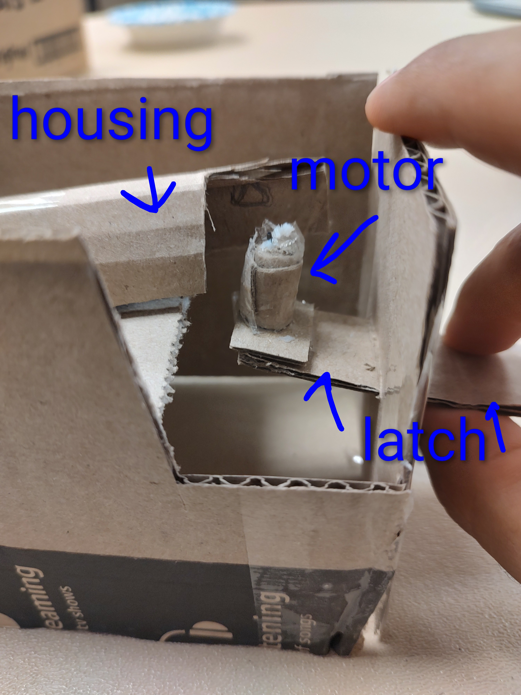
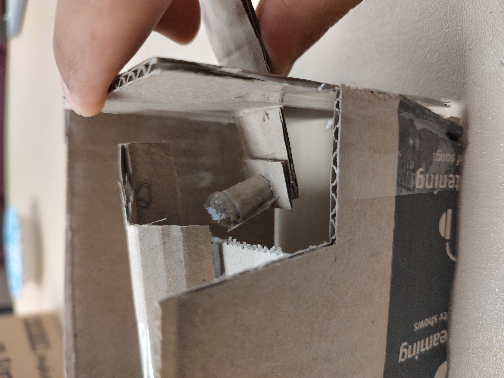
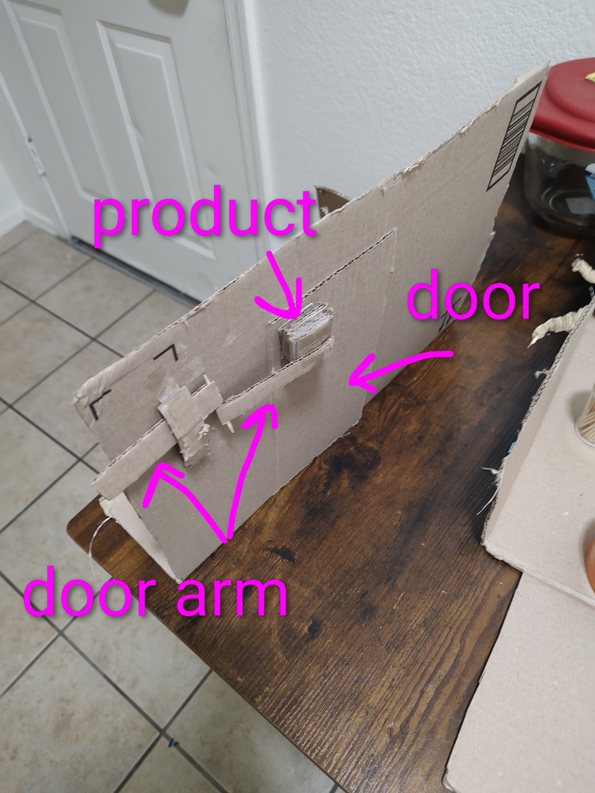
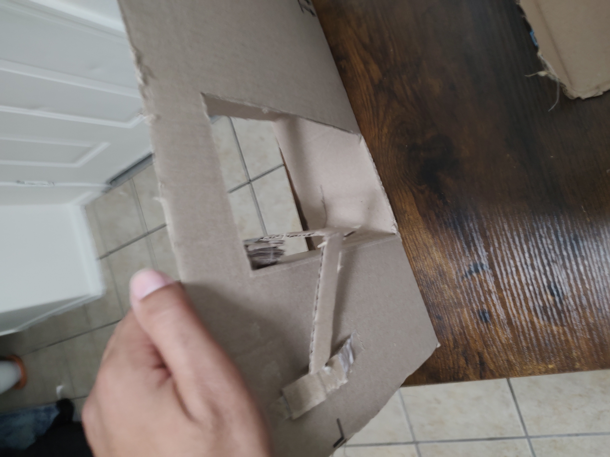
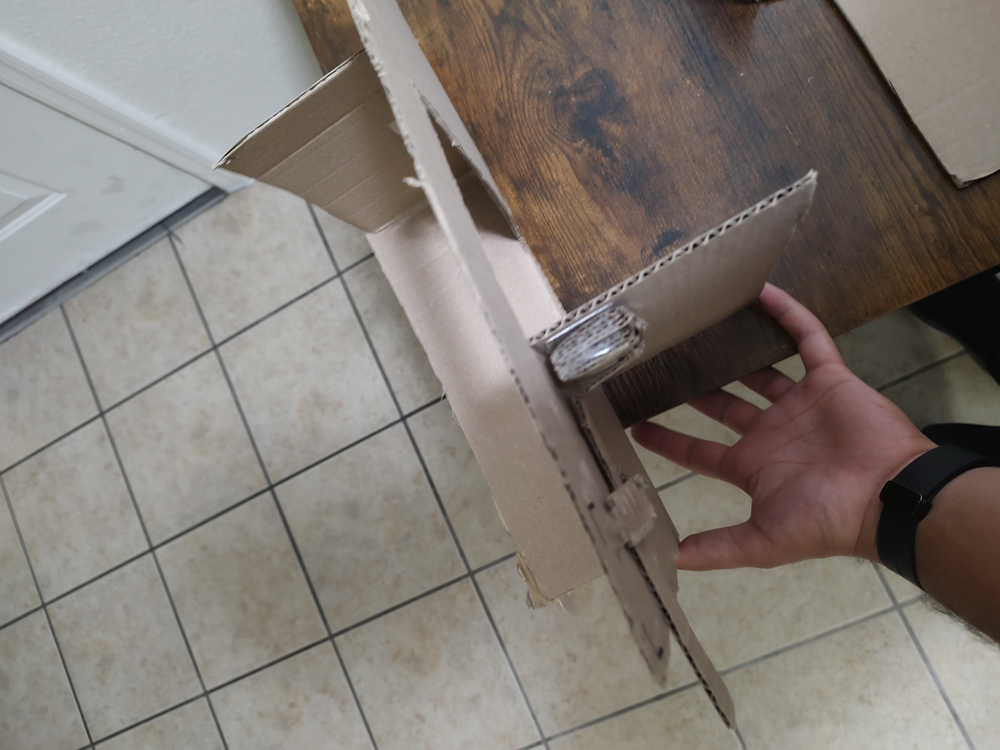

title: Design Ideation
tags: - tag1 - tag2

---

## Intro/overview

The goal of the Design Ideation phase was to convert previously established user needs and product requirements into functional design features. To achieve this goal, the team prioritized the needs/requirements we viewed as most important as well as most practical for the scope of our project. We then brainstormed multiple solutions for each of them which, when put together, could form successful features to be used in the design of our product. Finally, we created 3 distinct design concepts to help ourselves and potential clients see the vision of our project.

### Connection to Product Requirements

The “requirement / need” statements used throughout this page are now aligned directly with our **Product Requirements** document. During this ideation activity, we:

- Merged overlapping user needs and product requirements into a single consistent list.
- Updated the Product Requirements so that each requirement appears (possibly slightly rephrased) in the table below.
- Ensured that every selected feature traces back to one of these product requirements.

In other words, the requirements we ideate from here are the same requirements we will design and test against in later phases.

---

## Generating Ideas

Shown below is the table of brainstormed features correlating to their prioritized user need/requirement.

|                                                           requirement / need |          feature          | detail                                                                                                                                                                                                                                                                |
| ---------------------------------------------------------------------------: | :-----------------------: | --------------------------------------------------------------------------------------------------------------------------------------------------------------------------------------------------------------------------------------------------------------------- |
|                            The product must stop if something is in the way. |          Sensor           | The device has an additional sensor focusing on the doorway line to make sure there is nothing in the area. This is important because we do not want the door to shut on people, animals, or objects.                                                                 |
|                            The product must stop if something is in the way. |       Smaller Motor       | The device only produces a max of 10lbs of force. This is important because if someone gets stuck in between the door they can push the door to prevent closure.                                                                                                      |
|                            The product must stop if something is in the way. | Resistance-sensing Motor  | The motor is able to send data about the force acting against it, and if the force is over a certain threshold, the motor stops and reverses.                                                                                                                         |
|                            The product must stop if something is in the way. |       Radar/Sensor        | The device sends and receives transmissions to and from a chip that users carry. The door remains open as long as the chip is within a certain distance from the device (~2 feet).                                                                                    |
|                            The product must stop if something is in the way. |        Microphone         | The device listens for a keyword (such as "stop") and upon registering the keyword, stops the motor.                                                                                                                                                                  |
|                             The product must be easy to open in an emergency |           Latch           | The device has a latch inside that unhinges the motor to the door, causing the door to open without resistance. This is important because it refers to safety if the mechanism loses power.                                                                           |
|                             The product must be easy to open in an emergency |          Button           | The device has a secret button that will turn the motor off to make opening the door easier. This is important because it refers to safety if the mechanism loses power.                                                                                              |
|                             The product must be easy to open in an emergency |          Pin/Key          | The device disengages the motor when a key/pin is inserted through a hole. This is important because it refers to safety if the mechanism loses power.                                                                                                                |
|                             The product must be easy to open in an emergency |        Microphone         | The device disengages the motor when a keyword (such as "disengage") is spoken by the user.                                                                                                                                                                           |
|                                  The product can stay closed around children | Proximity/distance sensor | This device will be able to stay closed if the object/person is too short. This is to prevent children or animals from getting into something they are not supposed to. This is important as it was stated in our user needs.                                         |
|                                  The product can stay closed around children |       Radar/Sensor        | The device sends and receives transmissions to and from a chip that authorized users carry. The device only operates when the chip is within a certain distance (~ 3 feet).                                                                                           |
|                                  The product can stay closed around children |       Button/Switch       | The device has a button or switch in an inconspicuous area which acts as a "child lock". The motor will not activate until the button/switch is activated again.                                                                                                      |
|                                  The product can stay closed around children |    Facial Recognition     | The device uses a facial scanner to store authorized users' Face IDs. An authorized face must be scanned in order for the motor to activate.                                                                                                                          |
|                                  The product can stay closed around children |          Scanner          | The device has a QR/Barcode scanner that activates when a user is in the proximity. The user must present the proper QR/Barcode to activate the motor.                                                                                                                |
|                        The product is able to work in case of a power outage |     Seperate Battery      | This is very important in case everything loses power. The device has a small battery that can power the door for an amount of time until the power gets back on.                                                                                                     |
|                        The product is able to work in case of a power outage |       Power Adapter       | The product comes with an adapter that can hook up to a power bank (such as those commonly used to charge small devices). The device can perform basic functioning at this lower power slowly and/or for a short time.                                                |
|                        The product is able to work in case of a power outage |    Capacitor Failsafe     | The device has a series of capacitors that, upon the device losing power, provide a boost of current just strong enough to let the door open/stay open.                                                                                                               |
|                        The product is able to work in case of a power outage |       Spring system       | The door is spring loaded when shut. If power to the device is lost, the motor disengages and the spring pushes the door open.                                                                                                                                        |
|                    The product will start opening before user gets too close |      Forward Sensor       | This sensor will measure objects equal to the door length plus an additional 6-12 inches. This is important because the door should not open and hit the customer while in use.                                                                                       |
|                    The product will start opening before user gets too close |       Sensor/radar        | The user will carry a chip which tells the device to activate the motor when they are within a certain radius.                                                                                                                                                        |
|                 The product distinguishes between adults, kids, and animals. |      Distance Sensor      | This device will distinguish between different heights to promote safety and prevent kids or animals from opening doors that they should not open.                                                                                                                    |
|                 The product distinguishes between adults, kids, and animals. |       Sensor/Radar        | The device can detect chips carried by authorized users.                                                                                                                                                                                                              |
|                 The product distinguishes between adults, kids, and animals. |        Microphone         | The product can listen to/distinguish between different voices, only activating when the correct voice is heard.                                                                                                                                                      |
|                 The product distinguishes between adults, kids, and animals. |      Knowledge Test       | The device submits a query to each potential user which only an adult would know the answer to.                                                                                                                                                                       |
|                 The product distinguishes between adults, kids, and animals. |    Soundwave Detection    | The device can identify the walking-pattern sound/vibration of children and animals, and deny them access.                                                                                                                                                            |
|                                         The product can lock/unlock the door |          Slider           | The device will have a slider installed next to the door latch. This will slide before and after the door moves. This is important because some doors should stay locked/closed while the device does not activate.                                                   |
|                                         The product can lock/unlock the door |          Pulley           | The device has a pulley that is run with the motor. This will pull at the latch to unlock the latch.                                                                                                                                                                  |
|                                         The product can lock/unlock the door |      Motor Function       | The device has a mode which keeps the system in tension, pushing back against attempts to manually open the door.                                                                                                                                                     |
|                                         The product can lock/unlock the door |       Second Motor        | The device has a motor attached to the existing lock on the door, which can activate/deactivate it.                                                                                                                                                                   |
|                                         The product can lock/unlock the door |      Magnetic Field       | A magnet is attached to the edge of the door. The device can induce a strong magnetic field from the doorframe which resists movement of the magnet.                                                                                                                  |
|                                         The product can lock/unlock the door |      Friction Brake       | The device controls a pad attached to the bottom edge of the door. This pad pushes against the ground, creating friction and resisting movement.                                                                                                                      |
|                                       The product has an auto close feature. |      Delay in Sensor      | After someone leaves the sensor view, there will be a delay then it will start closing. This is important so that the door can be closed and locked depending on user preference.                                                                                     |
|                                       The product has an auto close feature. |     Programmed Timer      | The device closes the door after an amount of time from when it opened, selected by the user.                                                                                                                                                                         |
|                                       The product has an auto close feature. |       Sensor/Radar        | The device closes once a chip, carried by all users, is outside a certain radius.                                                                                                                                                                                     |
|                                       The product has an auto close feature. | Multi-directional Sensors | Sensors on each side of the door are multi-directional. The device closes only once all objects are outside of a certain range.                                                                                                                                       |
|                                       The product has an auto close feature. |     Movement Tracking     | A camera/sensor locks onto the user when they approach. It stays locked on until the user is outside a certain range, then the door closes.                                                                                                                           |
|                                       The product has an auto close feature. |       Motion Sensor       | The device closes the door once no motion is detected.                                                                                                                                                                                                                |
|                                       The product has an auto close feature. |        Microphone         | The device closes the door if the volume of the room stays below a threshold for a certain amount of time.                                                                                                                                                            |
|                                       The product has an auto close feature. |     Tripwire Sensors      | The device is linked to sensors placed a few feet past each side of the door. When the user walks past the sensor opposite from the direction they entered, the device closes the door.                                                                               |
|                                       The product has a simple power supply. |          Battery          | The device has a battery that powers it. This will be convenient so that there are no extra wires outside the product.                                                                                                                                                |
|                                       The product has a simple power supply. |           Wired           | The device has a power wire that runs around the door and into a power outlet. This prevents the device from needing to have batteries replaced and supplies constant power.                                                                                          |
|                                        The product has a simple power supply |           Solar           | The device will have a small solar panel on the side. This will help recharge the device as long as it is near a light source.                                                                                                                                        |
|                                The product has 90 or 180 degree openability. |         360 Motor         | The door opens as much as it can by connecting the door straight to the motor.                                                                                                                                                                                        |
|                                The product has 90 or 180 degree openability. |      Teethed Pulley       | The motor is connected to a pulley that will pull the door open. This will also work in reverse which will help push the door closed.                                                                                                                                 |
|                                The product has 90 or 180 degree openability. |      Mechanical Arms      | The motor is connected to mechanical arms that will rotate and bend to open the door. This will prevent loss of tension and can help with how much power the motor is using.                                                                                          |
|                                The product has 90 or 180 degree openability. |        Dual-motor         | The device has a motor on either side of the door. They are connected by a strong yet thin string/wire attached to the door. The motors synchronously run in opposite directions to allow each other to pull the door in either direction.                            |
|                                The product has 90 or 180 degree openability. |          Magnets          | A magnet is attached to the top of the door. The device moves a second magnet along a ceiling-mounted track, pulling the door with it to a specified number of degrees.                                                                                               |
|                 The product does not interfere with manual opening of doors. |  Auto-Disengage Program   | If the device senses someone trying to open the door and it is not in a lock setting, then the device will disengage the motor so that the motor is not fighting the user in opening the door.                                                                        |
|             The product does not interfere with the manual opening of doors. |       Assisted Open       | When the device senses manual use of the door, the motor activates to continue moving the door in the same direction.                                                                                                                                                 |
|                 The product does not interfere with manual opening of doors. |       Handle Sensor       | A sensor on the door handle disengages the motor and allows free movement of the door.                                                                                                                                                                                |
|             The product does not interfere with manual opening of the doors. |       Stand-by Mode       | "Stand-by Mode" can be activated which disengages all device features for a period of time or until the mode is switched off.                                                                                                                                         |
|             The product does not interfere with manual opening of the doors. |     Motor Auto-Clutch     | When the door is manually opened, the motor does not activate but also does not fully detach, allowing the door to move freely until movement stops.                                                                                                                  |
|         The product stops operation when sensing more resistance than usual. |  Auto-Disengage Program   | This can happen if the door is locked, latched, or something is blocking the door. To prevent damage to the device and the objects, the device will disengage the motor after it exerts more than 10 lbs of force.                                                    |
|         The product stops operation when sensing more resistance than usual. |    Self-Sensing Motor     | If the motor is moving, then stops moving earlier than expected for more than 1 second, it will deactivate.                                                                                                                                                           |
|         The product stops operation when sensing more resistance than usual. |       Power Sensing       | The motor is supplied with variable power when met with varying resistance to keep its speed constant, up until a threshold at which it deactivates.                                                                                                                  |
|                         The door can stay closed while the customer is gone. |           Latch           | The device can come with a latch on the top of the door so that when closed, the latch engages and locks the door for the user.                                                                                                                                       |
|                         The door can stay closed while the customer is gone. |          Slider           | The user can engage or disengage a slider. This will prevent the device from using the slider to unlock the door and keep the door closed.                                                                                                                            |
|                         The door can stay closed while the customer is gone. |        Off Switch         | When the user leaves, they can press a delayed off switch that will turn off the motor after 10 min. This means that the next time the customer comes to the door, they will either have to open it themselves or turn the motor back on.                             |
|                                         The device does not stay on all day. |           Timer           | The device has a timer that will turn the motor off after 10 min. The sensor will stay on and turn the rest of the components back on if it senses movement.                                                                                                          |
|                                         The device does not stay on all day. |           Clock           | The device will have a clock which can program the device to turn off during certain times of the day. This is important because it turns the whole device off which saves energy and prevents the door from automatically opening when the user does not want it to. |
|                                         The device does not stay on all day. |       Power Button        | The device has a button which cuts off all power to itself, and can also restore power to itself.                                                                                                                                                                     |
|                                         The device does not stay on all day. |          Sensor           | The same sensor which tells the motor to open the door can also be used to turn off the device (such as if the sensor is receiving input for longer than 15 seconds).                                                                                                 |
|                                            The product must follow ADA rules |      Distance Sensor      | The device will read at least 32 inches from the door for when the door opens forward so that it follows ADA compliance. This will also prevent the door from opening in front of users and colliding with objects that are moving toward the door.                   |
|                                            The product must follow ADA rules |        Motor Speed        | The motor speed will be controlled to take at least 3 seconds to fully open, and at least 5 seconds to close the door from 90 degrees open.                                                                                                                           |
|                                            The product must follow ADA rules |    Resistance Testing     | When the door is being manually opened, any resistance from the motor or other hardware will not exceed 5 pounds.                                                                                                                                                     |
|                                            The product must follow ADA rules |   Mounting Instructions   | Instructions included with the device will inform the user to mount the user interface between 34 and 48 inches above the floor.                                                                                                                                      |
|                                            The product must follow ADA rules |        Ergonomics         | All interactable elements of the device will have special design consideration to be activatable with one hand, without tight grasping, pinching, or wrist-twisting.                                                                                                  |
|                                            The product must follow ADA rules |    User Setting Limits    | The device will not allow the user to program the device to close the door sooner than 5 seconds after it has opened.                                                                                                                                                 |
|                                               The product is easily adjusted |       UI w/ Buttons       | The device has a user interface which allows the user to program settings through the use of buttons.                                                                                                                                                                 |
|                                               The product is easily adjusted |     UI w/ Touchscreen     | The device has a user interface which allows the user to program settings through the use of a touchscreen.                                                                                                                                                           |
|                                               The product is easily adjusted |       Potentiometer       | The motor has a physical dial which electrically changes its strength and/or speed.                                                                                                                                                                                   |
|                                               The product is easily adjusted |       Sliding Motor       | The motor can be moved along the width of the door to adjust its effect on the door using the concept of torque.                                                                                                                                                      |
|                                               The product is easily adjusted |  Non-destructive Mounts   | The mounting process of the device components uses technology such as adhesive/suction which do not cause damage to surfaces and are easy to relocate.                                                                                                                |
|                           Products are installed by those with no experience |    Limited Part Count     | The device, when received by the consumer, has the minimum possible number of components that must be put together/installed.                                                                                                                                         |
|                           Products are installed by those with no experience |      Modular Design       | Any components that must be put together/installed by the consumer have attachments which are simple and intuitive.                                                                                                                                                   |
|                           Products are installed by those with no experience |  Effective Instructions   | An instruction booklet is written and modified, along with the installation process, until testing shows that the majority of users have zero struggles with installation.                                                                                            |
|                           Products are installed by those with no experience |      Digital Access       | The instructions for installation feature a QR code which links to helpful video/picture tutorials.                                                                                                                                                                   |
|                   The product can be installed without the user owning tools |      Included Tools       | All tools required for installation are included in the packaging.                                                                                                                                                                                                    |
|                   The product can be installed without the user owning tools |     No Tools Required     | The design uses innovation such as snap-together technology, adhesive, suction, etc. which do not require tools to install.                                                                                                                                           |
|                   The product can be installed without the user owning tools |      Self-installing      | The design is robotic and assembles itself on arrival.                                                                                                                                                                                                                |
|                             The product is easy to repair/debug if necessary |         Debugger          | The device can be prompted to scan its software for issues and attempt to remedy them.                                                                                                                                                                                |
|                             The product is easy to repair/debug if necessary |     Replaceable Parts     | Every hardware component of the device can be swapped out if necessary, and is available to purchase through our business or at public stores.                                                                                                                        |
|                             The product is easy to repair/debug if necessary |           Reset           | The device has a reset feature which reverts all settings/code back to its default state.                                                                                                                                                                             |
|                             The product is easy to repair/debug if necessary |    Recurring Self-Scan    | The device continually scans its software/hardware and can identify issues, reporting them to the user through audible/visual information.                                                                                                                            |
|                             The product is easy to repair/debug if necessary |      Virtual Support      | A website is created which provides solutions to common/possible issues. The website also links to live support.                                                                                                                                                      |
|                            The product has a durable build for long-term use |        Dust-Proof         | The main casing is sealed off to prevent dust from gathering on the electronics.                                                                                                                                                                                      |
|                            The product has a durable build for long-term use |      Water-Resistant      | The main casing uses materials which provide protection against mist/moisture.                                                                                                                                                                                        |
|                            The product has a durable build for long-term use |       Impact-Rated        | The components of the device are impact rated to withstand up to 50 lbs of instantaneous force.                                                                                                                                                                       |
|                            The product has a durable build for long-term use |        Rust-Proof         | Any metal components exposed to the environment are finished with an anti-rust coating.                                                                                                                                                                               |
|                            The product has a durable build for long-term use |     Elastic Materials     | When possible, slightly elastic materials such as rubber are used over rigid materials to allow reversible deformation rather than cracking/shattering.                                                                                                               |
|            The product must have clear signals for open, closed, and errors. |    Color-Changing LED     | The device has an LED which changes color based on status.                                                                                                                                                                                                            |
|            The product must have clear signals for open, closed, and errors. |       Blinking LED        | The device has an LED which is either on, off, or blinking in different patterns based on status.                                                                                                                                                                     |
|            The product must have clear signals for open, closed, and errors. |          Buzzer           | The device has a buzzer which uses different tones/patterns to indicate status.                                                                                                                                                                                       |
|            The product must have clear signals for open, closed, and errors. |          Speaker          | The device has a speaker which outputs spoken phrases based on status.                                                                                                                                                                                                |
|            The product must have clear signals for open, closed, and errors. |        Text Output        | The device outputs text to a screen near the doorframe based on its status.                                                                                                                                                                                           |
| The product’s most basic functioning requires little to no user programming. |       Default Mode        | The device is in "default mode" on arrival which has limited functionality but works safely in almost any environment.                                                                                                                                                |
| The product’s most basic functioning requires little to no user programming. |        Quick Setup        | The installation instructions explain how to program the device based on doorframe dimensions and desired function.                                                                                                                                                   |
| The product’s most basic functioning requires little to no user programming. |       Preset Modes        | The device has multiple preset software modes for the user to choose between after installing the device.                                                                                                                                                             |
| The product’s most basic functioning requires little to no user programming. |        Auto-Setup         | After installation, the device safely scans/feels out the environment through sensors/resistance-sensing and programs itself based on this information.                                                                                                               |
| The product’s most basic functioning requires little to no user programming. |        Built-in AI        | After installation, an AI asks the user questions about the product's environment and desired functionality, then programs the software based on this information.                                                                                                    |

---

## Ranking/Grouping of Features

After coming up with 100 feature ideas the team decided which features were the most relevant based on importance to the overall goal of our project, as well as innovation and feasibility. Some of the top ideas chosen by the team are shown below. We used these as a benchmark of what we would like the product to accomplish that will separate it from other similar products.

### Selected high-priority features

| Feature                | Detail                                                                                                                                                                                                                                                                       |
| :--------------------- | ---------------------------------------------------------------------------------------------------------------------------------------------------------------------------------------------------------------------------------------------------------------------------- |
| Sensor                 | The device has an additional sensor focusing on the doorway line to make sure there is nothing in the area. This is important because we do not want the door to shut on people, animals, or objects.                                                                        |
| Smaller Motor          | The device only produces a max of 10lbs of force. This is important because if someone gets stuck in between the door they can push the door to prevent closure.                                                                                                             |
| Latch                  | The device has a latch inside that unhinges the motor to the door causing the door to open without resistance. This is important because it refers to safety if the mechanism loses power.                                                                                   |
| Button/Switch          | The device has a button or switch in an inconspicuous area which acts as a "child lock". The motor will not activate until the button/switch is activated again.                                                                                                             |
| Seperate Battery       | This is very important in case everything loses power. The device has a small battery that can power the door for an amount of time until the power gets back on.                                                                                                            |
| Slider                 | The device will have a slider installed next to the door latch. This will slide before and after the door moves. This is important because some doors should stay locked/closed while the device does not activate.                                                          |
| Programmed Timer       | The device closes the door after an amount of time from when it opened, selected by the user.                                                                                                                                                                                |
| Tripwire Sensors       | The device is linked to sensors placed a few feet past each side of the door. When the user walks past the sensor opposite from the direction they entered, the device closes the door.                                                                                      |
| Wired                  | The device has a power wire that runs around the door and into a power outlet. This prevents the device from needing to have batteries replaced and supplies constant power.                                                                                                 |
| Mechanical Arms        | The motor is connected to mechanical arms that will rotate and bend to open the door. This will prevent loss of tension and can help with how much power the motor is using.                                                                                                 |
| Auto-Disengage Program | If the device senses someone trying to open the door and it is not in a lock setting, then the device will disengage the motor so that the motor is not fighting the user in opening the door.                                                                               |
| Motor Auto-Clutch      | When the door is manually opened, the motor does not activate but also does not fully detach, allowing the door to move freely until movement stops.                                                                                                                         |
| Auto-Disengage Program | This can happen if the door is locked, latched, or something is blocking the door. To prevent damage to the device and the objects, the device will disengage the motor after it exerts more than 10 lbs of force.                                                           |
| Timer                  | The device has a timer that will turn the motor off after 10 min. The sensor will stay on and turn the rest of the components back on if it senses movement.                                                                                                                 |
| Clock                  | The device will have a clock which can program the device to turn off during certain times of the day. This is important because it turns the whole device off which saves energy and prevents the door from automatically opening when the user does not want them to open. |
| Delay in Sensor        | After someone leaves the sensor view, there will be a delay then it will start closing. This is important so that the door can be closed and locked depending on user preference.                                                                                            |
| Distance Sensor        | The device will read at least 32 inches from the door for when the door opens forward so that it follows ADA compliance. This will also prevent the door from opening in front of users and colliding with objects that are moving toward the door.                          |
| Motor Speed            | The motor speed will be controlled to take at least 3 seconds to fully open, and at least 5 seconds to close the door from 90 degrees open.                                                                                                                                  |
| Resistance Testing     | When the door is being manually opened, any resistance from the motor or other hardware will not exceed 5 pounds.                                                                                                                                                            |
| Mounting Instructions  | Instructions included with the device will inform the user to mount the user interface between 34 and 48 inches above the floor.                                                                                                                                             |
| Ergonomics             | All interactable elements of the device will have special design consideration to be activatable with one hand, without tight grasping, pinching, or wrist-twisting.                                                                                                         |
| User Setting Limits    | The device will not allow the user to program the device to close the door sooner than 5 seconds after it has opened.                                                                                                                                                        |
| Forward Sensor         | This sensor will measure objects equal to the door length plus an additional 6-12 inches. This is important because the door should not open and hit the customer while in use.                                                                                              |
| UI w/ Buttons          | The device has a user interface which allows the user to program settings through the use of buttons.                                                                                                                                                                        |
| Non-destructive Mounts | The mounting process of the device components uses technology such as adhesive/suction which do not cause damage to surfaces and are easy to relocate.                                                                                                                       |
| Limited Part Count     | The device, when received by the consumer, has the minimum possible amount of components that must be put together/installed.                                                                                                                                                |
| Modular Design         | Any components that must be put together/installed by the consumer have attachments which are simple and intuitive.                                                                                                                                                          |
| No Tools Required      | The design uses innovation such as snap-together technology, adhesive, suction, etc. which do not require tools to install.                                                                                                                                                  |
| Replaceable Parts      | Every hardware component of the device can be swapped out if necessary, and is available to purchase through our business or at public stores.                                                                                                                               |
| Debugger               | The device can be prompted to scan its software for issues and attempt to remedy them.                                                                                                                                                                                       |
| Reset                  | The device has a reset feature which reverts all settings/code back to its default state.                                                                                                                                                                                    |
| Dust-Proof             | The main casing is sealed off to prevent dust from gathering on the electronics.                                                                                                                                                                                             |
| Color-Changing LED     | The device has an LED which changes color based on status.                                                                                                                                                                                                                   |
| Buzzer                 | The device has a buzzer which uses different tones/patterns to indicate status.                                                                                                                                                                                              |
| Text Output            | The device outputs text to a screen near the doorframe based on its status.                                                                                                                                                                                                  |
| Quick Setup            | The installation instructions explain how to program the device based on doorframe dimensions and desired function.                                                                                                                                                          |
| Preset Modes           | The device has multiple preset software modes for the user to choose between after installing the device.                                                                                                                                                                    |

### Embedded-systems features we can build in this class

From the selected features above, the **embedded systems** elements that we plan to implement and demonstrate (using a microcontroller, sensors, and actuators) include:

- **Sensing and safety:** door-line Sensor, Forward Sensor, Distance Sensor, Tripwire Sensors, Motion Sensor (subset of ideas above as practical choices).
- **Motor control:** Motor Speed control, Auto-Disengage Program, resistance-based shutoff (Self-Sensing Motor / Resistance Testing).
- **Timing and logic:** Programmed Timer, Timer + Clock-based scheduling, User Setting Limits for minimum open times.
- **User interface:** UI w/ Buttons, Quick Setup, Preset Modes for different behaviors.
- **Feedback outputs:** Color-Changing LED, Buzzer, Text Output to indicate open/closed/error states.
- **Power behavior:** handling of backup power (Seperate Battery) and safe shutdown timing (Timer / Clock).

These are all directly drawn from our feature list and correspond to realistic, demonstrable embedded system functionality for this course.

---

Next, the team created three groups from the chosen features which could be combined into separate product concepts. These concepts showcase complete visions of how multiple features—mechanical, sensing, power, and user interface—work together, each with a slightly different focus.

|             Group              |        Feature         | Detail                                                                                                                                                                                                                                              |
| :----------------------------: | :--------------------: | --------------------------------------------------------------------------------------------------------------------------------------------------------------------------------------------------------------------------------------------------- |
|       Free Door Movement       |         Latch          | The device has a latch inside that unhinges the motor to the door causing the door to open without resistance.                                                                                                                                      |
|               -                |    Mechanical Arms     | The motor is connected to mechanical arms that will rotate and bend to open the door. This will prevent loss of tension and can help with how much power the motor is using.                                                                        |
|               -                | Auto-Disengage Program | If the device senses someone trying to open the door and it is not in a lock setting, then the device will disengage the motor so that the motor is not fighting the user in opening the door.                                                      |
|               -                |   Motor Auto-Clutch    | When the door is manually opened, the motor does not activate but also does not fully detach, allowing the door to move freely until movement stops.                                                                                                |
|               -                | Auto-Disengage Program | This can happen if the door is locked, latched, or something is blocking the door. To prevent damage to the device and the objects, the device will disengage the motor after it exerts more than 10 lbs of force.                                  |
|               -                |   Resistance Testing   | When the door is being manually opened, any resistance from the motor or other hardware will not exceed 5 pounds.                                                                                                                                   |
|               -                |       Ergonomics       | All interactable elements of the device will have special design consideration to be activatable with one hand, without tight grasping, pinching, or wrist-twisting.                                                                                |
|               -                |       Dust-Proof       | The main casing is sealed off to prevent dust from gathering on the electronics.                                                                                                                                                                    |
| Multi-Directional Arm Function |    Mechanical Arms     | The motor is connected to mechanical arms that will rotate and bend to open the door. This will prevent loss of tension and can help with how much power the motor is using.                                                                        |
|               -                |    Distance Sensor     | The device will read at least 32 inches from the door for when the door opens forward so that it follows ADA compliance. This will also prevent the door from opening in front of users and colliding with objects that are moving toward the door. |
|               -                |      Motor Speed       | The motor speed will be controlled to take at least 3 seconds to fully open, and at least 5 seconds to close the door from 90 degrees open.                                                                                                         |
|               -                |     UI w/ Buttons      | The device has a user interface which allows the user to program settings through the use of buttons.                                                                                                                                               |
|               -                |      Preset Modes      | The device has multiple preset software modes for the user to choose between after installing the device.                                                                                                                                           |
|      Sensor Functionality      |         Sensor         | The device has an additional sensor focusing on the doorway line to make sure there is nothing in the area. This is important because we do not want the door to shut on people, animals, or objects.                                               |
|               -                |    Programmed Timer    | The device closes the door after an amount of time from when it opened, selected by the user.                                                                                                                                                       |
|               -                |    Tripwire Sensors    | The device is linked to sensors placed a few feet past each side of the door. When the user walks past the sensor opposite from the direction they entered, the device closes the door.                                                             |
|               -                |    Distance Sensor     | The device will read at least 32 inches from the door for when the door opens forward so that it follows ADA compliance. This will also prevent the door from opening in front of users and colliding with objects that are moving toward the door. |
|               -                |      Motor Speed       | The motor speed will be controlled to take at least 3 seconds to fully open, and at least 5 seconds to close the door from 90 degrees open.                                                                                                         |
|               -                |  User Setting Limits   | The device will not allow the user to program the device to close the door sooner than 5 seconds after it has opened.                                                                                                                               |
|               -                |     Forward Sensor     | This sensor will measure objects equal to the door length plus an additional 6-12 inches. This is important because the door should not open and hit the customer while in use.                                                                     |
|               -                |    Delay in Sensor     | After someone leaves the sensor view, there will be a delay then it will start closing. This is important so that the door can be closed and locked depending on user preference.                                                                   |

---

## Concept Models

Below we describe each concept not only by a single sub-feature, but as a **more complete system** that combines sensing, control logic, mechanical movement, user interface, and signaling—using only features listed above.

---

### **Model 1 – Free Door Movement**

#### System-level concept

Model 1 is a concept focused on **safe manual override and low resistance**. In this configuration:

- **Mechanical system:** Mechanical Arms connect the motor to the door. Under normal operation, the motor opens and closes the door through these arms.
- **Manual override:** A Latch and Motor Auto-Clutch allow the user to immediately disengage the motor, so the door can move freely with minimal resistance. This satisfies emergency-access requirements and makes manual use comfortable.
- **Protection & safety:** The Auto-Disengage Program and Resistance Testing monitor motor torque. If resistance exceeds a threshold (e.g., door blocked or locked), the microcontroller stops driving the motor and/or disengages it to protect both the user and hardware.
- **Ergonomics & usability:** All interactable elements (such as the manual lever and any override buttons) follow our Ergonomics requirement, ensuring they can be operated with one hand and without tight grasping.
- **Enclosure & durability:** A Dust-Proof housing protects the embedded electronics and motor from dust, improving long-term reliability.

#### Key embedded-systems features in Model 1

- Microcontroller monitors motor current/position for **Resistance Testing** and triggers the **Auto-Disengage Program**.
- Input from a **Handle Sensor** or similar could be used to automatically switch to free-movement mode when manual opening is detected.
- Status feedback (e.g., via **Color-Changing LED** or **Buzzer**) can indicate when the system is in automatic vs. manual/override mode.

  
**Lever to Disengage Motor 1**

The motor stays inside the housing where it will connect to gears that will move the arms of the door. If there is an emergency, the motor can be disengaged.

  
**Lever to Disengage Motor 2**

By disengaging the motor, the motor is moved below the housing where it can rotate, but nothing will happen to the door. This also prevents the motor from pushing against the user if they are trying to keep the door from opening or closing.

---

### **Model 2 – Multi-Directional Arm Function**

#### System-level concept

Model 2 is a **full product concept** that emphasizes **flexible motion and controlled timing**:

- **Mechanical system:** Mechanical Arms are designed to provide at least 90° of opening and can be configured to allow up to 180°. This lets the door swing either inward or outward depending on user approach and room layout.
- **Sensing & compliance:** A Distance Sensor ensures users and obstacles are far enough (≥ 32 inches) from the swing path, meeting ADA requirements and reducing collision risk.
- **Motor control:** Motor Speed is regulated so that opening and closing occur within specified time windows (≥ 3 seconds to open, ≥ 5 seconds from 90° to closed), again supporting ADA rules.
- **User interface:** A UI w/ Buttons allows users to choose between preset modes (e.g., “90° only”, “180° if space allows”, “always open away from the user”). Preset Modes define different combinations of speed, angle, and direction logic.
- **Power & basic behavior:** This concept is compatible with the wired power supply and can incorporate the Programmed Timer for auto-close behavior after a user-configurable delay.

#### Key embedded-systems features in Model 2

- The microcontroller reads **Distance Sensor** data to decide whether to allow 90° or 180° opening.
- Motor control firmware enforces the **Motor Speed** requirement and smooth acceleration/deceleration.
- The **UI w/ Buttons** and **Preset Modes** are implemented as menus on the embedded system, allowing users to switch operating modes without reprogramming.

  
**90 and 180 degree arm 1**

The product is designed to open at least 90 degrees. An additional arm which can rotate in a housing lets the door rotate an additional 90 degrees.

  
**90 and 180 degree arm 2**

This shows the first 90 degree opening. This with additional programming can make a door have the ability to always push out away from the user to increase safety and decrease injury.

  
**90 and 180 degree arm 3**

This shows the second 90 degrees in the opposite way. Though not all doors would be able to use this, this provides an opportunity for more open doors and increases mobility instead of waiting for a door to open in your direction.

---

### **Model 3 – Sensor Functionality**

#### System-level concept

Model 3 is a **sensor-first concept** that shows how different sensing and timing features work together to control the door automatically:

- **Approach detection:** A Forward Sensor and Distance Sensor detect an approaching user from a safe distance (door length + 6–12 inches). This lets the system begin opening before the person reaches the door.
- **Path safety:** A doorway-line Sensor and Tripwire Sensors ensure that the door does not close while the user is still within the path or has not fully cleared the doorway.
- **Timing & user control:** A Programmed Timer plus User Setting Limits enforce safe minimum open times (e.g., at least 5 seconds) and allow the user to adjust how long the door stays open after use.
- **Closing logic:** Delay in Sensor is used so that once no motion is detected and the user has crossed the Tripwire Sensor on the far side, a timed delay elapses before the door closes.
- **Status feedback:** Color-Changing LED, Buzzer, and/or Text Output can provide indications such as “Opening”, “Open”, “Closing”, or “Error/blocked”.

All of these behaviors can be implemented in an embedded controller that reads sensors and drives the motor according to our product requirements.

#### Example storyboard (John’s grandmother)

In this storyboard we took the example of John’s grandmother. She is 78 years old and has difficulty opening and closing doors because she uses a cane and her vision is limited. When she approaches the door, sensors mounted on the frame detect her presence from a safe distance. The motor then activates, opening the door slowly and wide enough to ensure it doesn’t hit her or any nearby objects. As she walks through, the sensors remain active, keeping the door open until she has fully cleared the doorway. Once no more motion is detected, the motor closes the door gently.

---

## Summary

The team’s brainstorming process followed a free-flow individual format. We discussed how we would approach this section of the project while we were in class together. We did not meet physically or virtually during the generation of feature ideas. The reasoning for this was that we did not want there to be any bias, “hive-mind” thinking, or judgement of ideas, intentional or not. Instead, we each individually came up with solutions to each need or requirement on our own time. We believe that this led to a greater variation of ideas and more thinking outside the box. It also allowed us to come up with ideas that were interesting to consider and get inspiration from, even if they were unconventional, unrealistic, or did not fit the scope/resources of our project. Another part of the process that led to variation of ideas was the amount that were required. Coming up with 100 unique ideas was very difficult, but it further enforced outside-the-box thinking and made us get creative.

Collecting ideas was done by first thinking of how we had seen these requirements solved by other products/competitors. Following what works in successful products ensures that ours will be successful as well. At the same time, it is easy to go for the simple solutions without realizing their flaws or comparing them to less conventional ideas that may be even better. Knowing this led us to think about how the problems had not been solved before, at least from what we had seen. We tried to come up with ideas that could work even better than the current standards, or features that would make our product stand out from the rest. This process gave us a mixed result of “tried-and-true” features and innovative ideas to choose from.

The list of requirements was formed from both the “User Needs and Benchmarking” and “Product Requirements” assignments. More of the requirements were drawn from the user needs because we had a larger list of them at our disposal and they were less specific, allowing us to come up with more feature ideas. However, we did include several of our product requirements since we had already decided they were very important to our end-product. As part of this activity, we updated the Product Requirements document so that each requirement there matches one of the requirement/need statements used in our ideation table, ensuring consistency between the two.

Since the ideas were already grouped based on which user need or requirement they referred to, we saw no need to group them into smaller categories before ranking them. The ranking process was simple. We first narrowed the list down by picking ideas that seemed most crucial to the overall goal of our project as well as which ones applied most to our consumer base. After that, we ruled out any features we knew would not be feasible based on our timeline and resources. Any ideas that were very similar did not need to be included twice, so we picked which ones from each likeness were slightly more detailed or inclusive.

The team then collected ideas based on patterns we saw which could combine into a greater feature that we wanted to showcase. Therefore, each concept model now represents a more complete vision of the product rather than a single sub-feature:

- **Model 1 (Free Door Movement)** highlights how mechanical arms, safety cutoffs, and manual overrides combine into a system that never fights the user and remains safe in emergencies.
- **Model 2 (Multi-Directional Arm Function)** shows how adjustable arms, distance sensing, controlled motor speeds, and preset modes deliver flexible motion while maintaining ADA compliance.
- **Model 3 (Sensor Functionality)** demonstrates how multiple sensors, timers, and user setting limits work together to automate opening and closing for users like John’s grandmother.

Across all three concepts, we deliberately emphasized the **embedded systems features** (sensors, timers, motor control logic, UIs, and feedback signals) that we can realistically build and demonstrate in this class using a microcontroller-based prototype. These concepts provide a look into the future of our product and better define how we as a team want to move forward with the design process while staying anchored to our product requirements.
