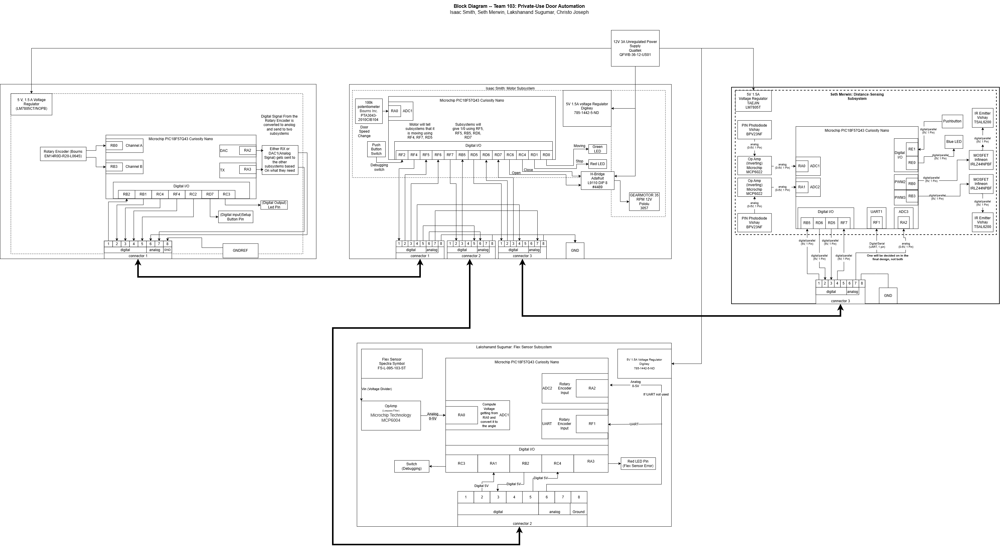

## Description

The block diagram below shows how our team's individual subsystems connect to each other. Each major block represents one subsystem showing the programmed microcontroller, which pins of it are being used (and how), and what those pins are connected to. The subsystems will connect to each other via a total of four 8-wire ribbon cables. The pin-headers for these cables are shown at the bottom of each subsystem block, and they display which of their pins are connected to the subsystem. Any pins on the headers that do not have arrows will not be used in the design. The large, bold, bidirectional arrows between subsystems represent the 8-wire ribbon cables themselves, showing which subsytems are directly connected to each other. This diagram helps the team and stakeholders understand the general function of each subsystem as well as how they will be communicating to form a complete system.

## Block Diagram of Subsystems

This is the whole system where each subsystem is connected to another with an 8-wire ribbon cable. The motor is used as a bridge from the flex sensor and the rotary encoder during initial calibration. Every subsystem is then connected to the motor to feed and recieve information from its inputs and motion. 

### Motor

Link to Draw.io is [here](https://viewer.diagrams.net/?tags=%7B%7D&lightbox=1&highlight=0000ff&edit=_blank&layers=1&nav=1&title=Individual%20Motor%20Subsystem.drawio&dark=auto#R%3Cmxfile%3E%3Cdiagram%20name%3D%22Page-1%22%20id%3D%22eZ7gXXGAp_J01Qm2sftV%22%3E7V1dd6q4Gv41rjX7wq6Eby5b3e3sc9p9OnZmz%2Bxzl2qqTNE4iK3uXz%2BJgkKSgggkuNa%2BaSEmQJ68X08SXnrmYL65i9By9kAmOOwZYLLpmcOeYUAIPfqPlWz3JQ5ICqZRMEkqHQuegh84KQRJ6TqY4FWuYkxIGAfLfOGYLBZ4HOfKUBSR93y1FxLm77pEUywUPI1RKJb%2BGUzi2b7Us8Gx%2FFccTGfpnSFIfpmjtHJSsJqhCXnPFJmfe%2BYgIiTeH803Axwy8FJc9u1uP%2Fj18GARXsSnNHjZ%2FP8p%2BjGO%2FYdv%2FzjDu6%2Ff%2FbtJ39hf5Q2F66TDX1YIjXvmNS19IDGJkoePtykiEVkvJphdFPTMm%2FdZEOOnJRqzX9%2BpDNCyWTwP6Rmkhy9BGA5ISC9jDhdkQSvdvOEoDijA12EwXdDimLA2Ym%2BSDrLqeJMpSnp3h8kcx9GWVkl%2BtbwE6UTUoJ%2Bcvx8HzneSsllm0CwrKUSJsEwP1z7iSQ8SSCvA60EB38bxnKDVbNccNgMjNKw8jgYQcYSeDEejNRxFOe08jjYsh9E1JTAaflswmgKKD8E4IuNZsKTFj18G0Lu13d8sWg8M1lFAVkHMevQVLUg9vOVKLxmFOXlDz7tbsGYRXgU%2FsuckRnHmnHobnD3HkyB7GpLx6%2BEJEw%2BR%2BbmJQbbt%2FCAb4iDbQDbIsK1BtoSRwhPq0pJTEsUzMiULFH4%2Blt7kx%2FJY556wcdqB9TeO423in9E6JvnxpQhG279Y%2Bys7Pf2eXG53Mtzkzrbp2SaIM83o2ff0ivT42IidpG0%2BHLYVWUdjXACN7SQRBIqmOC5SlERTGHKFYhDhEMXBWz5YkA1p0vSRBPShD%2BLjGnnxsU1OKvZPmrQ6CsZ1FKFtptqSVVgV3Adw97G4WKHsufL16cH%2BCY5SesDkfMG1tQiuVABBoQCeK%2BznC65xquCmcWnbguvYJYK771JtwRXuYxcLru8X1m9HcJ0LFFxoZCUXXgFYZqnZ2SOOAooWjupLNDxVog01Es178rYkmr%2BPVSLRjmHWq2%2FC9jXA1asBLoAZHWDCbJ2oBznzfeXaZUpAr9KcDqSiXaoDfisqUFVyfWDkJcsrlkQIfFCvgQ3t9mXX0yy7vpGXXeCcJbvGT9ktkl2Ls7puiShCjr1Xb%2BApkN0E3Ny0iBPGjBkHb%2FRwGu8GeV%2B0WqJFWvZr%2FyYK2JAkv9G7Z3%2FOFEsu9OG1M0rk%2FLNmE5s3z2j8Ot2pS3%2B8Z%2FpsZjGaPv9iMEdIuw0OBxAYn%2FbXTBqnd0ET9BKtg1jT04aMtvcnKHr9peDBd0fsd9PdH6f%2Fwad9r8DHlwRJzbTB8WLizejBJzlM9%2F5OCMHwyyP96102WnzneoZpWZ5fsVN15qxC9IzDm0MfuYmqD01nhZlWaMmNTG6mFUpmj5y2Jo%2FSmxVblGRhoFM2YkSeSbyaUf97ESbN9izw512fsoHHh77N4h4AjW8KpbsJ%2BTUBF69ZEvmVzX62J79QQEVhNJdlIUdeXi2OKwvjzg%2FZ%2FBMjNtjOHFLVkA0aLiddoCQEExq4CiZ%2FEopSYjHvIoyZNbn%2FPGxDmSdBhMdxQNjSCkaruCH9hk4%2BajY9Ub9lC6r81Elz6u1IwOaAY6Z5%2BWHv86tAvcN6TYUlH35uXOa0Zai0Z%2FRcAZWkm8xLA9Ek1lq6o242JnOphBWPWTnC%2BhD0BAQnwTSIUXgx2B1WmU%2FzwK0t1UORkyLqS8n0YpDccLB9jKylElhDDM1ranarCmwoxUbcZyM6Bs3YbD4UI7VQGQJUZkehkrAJtVCJ%2B2XEzRXdgMrRDZUlQCUu53cDKkkMqxYqkTCIC8jdgApKtqypxUqM98Wlxo5gpd2wiyxAXNrqCFbaLbsY7wtQtc0jHX6rinYeaYihe5ZH1oyo6kbwhzHrMI80xRi9EzyyAnZd4ZGmGNJ3gUdWQLKjPNIUCYAaHnmeAiv1C6YY8avhkdXFSne4YYoRvxoeWR0q3dGGKUb8anhkdah080hTDPjV8MjqUOnmkaYY76vhkTVcoDasxHhfDY88Ayvthl1kAWp45BlY6bbslhjvC1C1zSM9p2s80hJD9yyPrBkm1I3grdMR1oegGKN3gkdWwK4rPNISQ%2Fou8MgKSHaUR1oiAVDDI89TYLV%2BQYz41fDI6mKlO9ywxIhfDY%2BsDpX2aEOM%2BNXwyOpQ6eaRlhjwq%2BGR1aHSzSMtMd5XwyNruEBdWKWvVyvnkWdgpduw2yILUMMjz8BKt2VP36bLYDVM433whV7yf%2FWQU5mGyeY3DUv4qCVLH9Qam7LFgOJnSpQ0d0EyWKVvBaSyr%2FmtANvjXuQsyWRim4X123knwBap0ei28fijsmY6XBYYS%2BJOZRSyte389knvToxunY6%2BAOXwbxVrB1QkU6PbxiOU6jjxSqsdJ5FJjW70Kyifdkk%2FTiKNGg07gJPTNZx8LRHGIVKw7FwSoCvfMwvjhTqxSYM5JLwTY490qlFz7OF6hal1SuvbfIZWrr7n2kX124lVHJHSjoaNTwBUVnGva7GKI9LZ0VC%2Fa%2FU0hiDX930Ibn9bw8Hfv%2BO%2FPkcAEqwpi19qz2CvelKc88gWZ4vOZF%2FmiRbQr2nv6om%2BuIQmCdMhAK8MBhJTGAKydxHdSrqgOY9Mxad9hA7479fLzuLSes6bnmFCj%2FnhQpQqdj6O0GKV6rOaXjhozpzD4nm1zI%2FuJeQBMbjAxbTNq7Qom3xd4oc848puy2yJszCy2QUKVGt5GZoAl0%2FCYJmih1eahMERZ21Gt40vRNaed9YfMUomYwYdiKy7Nhnj6Mkeemb%2BHbXT8%2BnaSWmA6HSDIvu8cDnFlBdCfsqrcgNLQZ5FRzIPNtBv8vyuzRc6eubBaquyb7tZZb4ChlGo0Jpyqaa5pnRn5gLpvqMTc1JDCO16DUxfgZa7sqmwxvc0VtfyrgU2rp4ke5k5a8PMa7rvlql6s9nr05ffyrPXu4o1NjewTeiEoWOszx8Zqx0TKc7V867X5C7R0JdbPD5LQEkSRP65qtZX87mATm3IKfvyRQ1hPPWzLenigu7onXfTfonw8J4pX78l4bmoD1ydLzzGqVGhpdrHfLDTil%2B9NIuFxzcL67ckPJK5qyHQHuJB0LXlTvdiPmpUQ8NOXX2zu8G7bD4WgMUa5vBvhkIVGiZurcrNuksWYV7IIu6vdjLBVligs9xIl0h2F3k%2B%2FxK770HSX4cBmkZoTo%2F6ffrnd7w7hsDcN36MgjcU4%2F4fK8wqk91Lq9dUVudol2L5uE7wXGE17tyH3n%2BP1wBP84Aagt060hNmR%2BABR%2B%2FBYlckXz3q%2BqrXPXpdzdACLSasU%2Bvpeo6ifZvBLApW1DgY4D9khZezeuth1AjHeTuziiPyirkd8ZJN8ijZHD%2BmmDDaKOyanweTyc70yXxE3hyy0U4MH3SacRsW53Jl6bmVvrfsyvKqCUtu9jcm7Vc2E6w3EsbsE9wGGOHpmlrPzn1Ygr2I8Yq3l7FnwPXsPrQso2%2F3vw4vfFUZcN%2FzPnwyt%2By1fNjEezrSzU2d4q2nUY9G9im5%2FomR0n6rkK6NSuljlmxUYt9ZATvr88ci2lud3SaAR%2FLOtixRV7RchlvNmt269%2F35Ua2TYDJt48Ls5oEoqrCb9DQiDLAjh6Cdmj2QCWY1%2FgU%3D%3C%2Fdiagram%3E%3C%2Fmxfile%3E).

Link to subsystem website is [here](https://isrysm52.github.io/01-Block-Diagram/Block-Diagram/).

* Importance:

This subsystem is the main brain of the Automatic Door Opener. The motor takes information from the flex sensor, the rotary encoder, and the two distance sensors to determine if it should move forward or backward. It also uses the information given to stop and wait for more input if there are problems with movement. 

### IR Sensors

Link to Draw.io is [here](Documents/Distance_Sensing%20Subsystem%20Block%20Diagram.drawio).

Link to subsystem website is [here](https://samerwin1.github.io/01-Block-Diagram/Block-Diagram/).

* Importance:

This subsystem is responsible for sensing users approaching the door as well as detecting obstacles in the path. When sensing someone approaching, the subsystem tells the motor to begin opening the door. While the door is opening or closing, the subsystem is checking to make sure nothing is in the way at several points along the path.

### Flex Sensor

Link to Draw.io is [here]().

Link to subsystem website is [here](https://lakshanandsugumar.github.io/lakshtest01.github.io/01-Block-Diagram/Block-Diagram/).

* Importance:

This subsystem is responsible for reading data from a flex sensor and communicating with the motor subsystem to control movement based on the sensor’s readings. At several points along the path of the door, the subsystem is checking that the amount of flex from the doorframe to the door matches up with the rotational angle of the door.

### Rotary Encoder

Link to Draw.io is [here](https://drive.google.com/file/d/13LKkwTJjgqqxmauylCVNC0H4SzO0dGRc/view?usp=sharing).

Link to subsystem website is [here](https://chvisto.github.io/01-Block-Diagram/Block-Diagram/).

* Importance:

This subsystem provides precise feedback on the door’s position and rotation. The rotary encoder sends digital signals to the microcontroller, allowing it to track how far and in what direction the motor has turned. This information is crucial for ensuring the door opens and closes accurately without over-rotating or stalling. Without this feedback, the system wouldn’t know the exact position of the door, leading to inconsistent or unsafe operation.

## Summary

Each component was chosen carefully to ensure safety as our top priority. Every system needed to connect to the motor to listen if the motor was in motion or tell the motor that there is something in the doorway so that the motor starts to open the door. This already met product requirements to open and close the door based off of sensors instead of a key fob, knob, or button. This also lets the door stop itself from closing into the user which enhances the safety and our requirement to make this door convienient and safe for all users. 

The next part of safety is two fold. The door calibrates itself at the begining of the installation process. This calibration can happen again if the button is pressed and there is a problen during calibration. This ensures that if there is additional strain on the product or an unforseen incident, the product will stop and prevent further injuries to itself and potentially the user. 

In conclusion, safety and convienience was always the number one requirement for our product. This should be used to help households and and destress inconvienient situations, not to cause more issues during an already stressful day. 