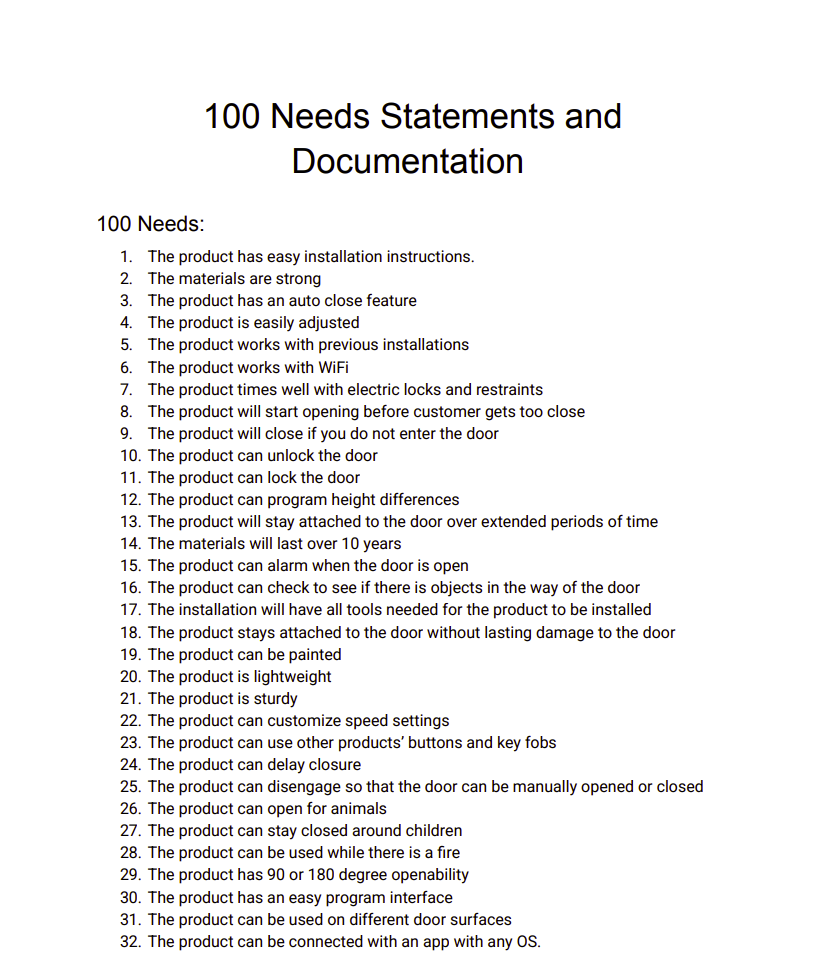
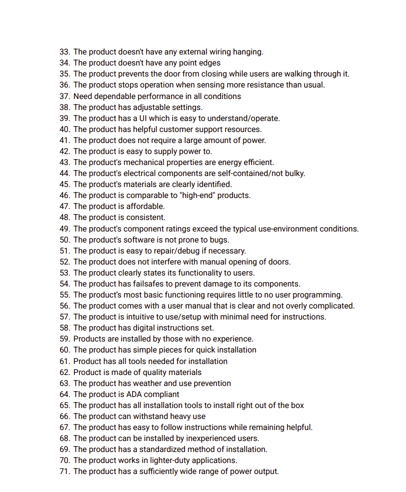
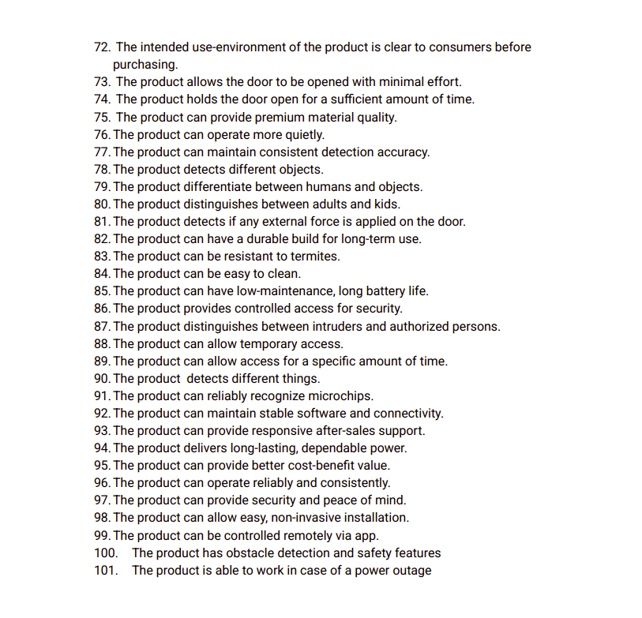
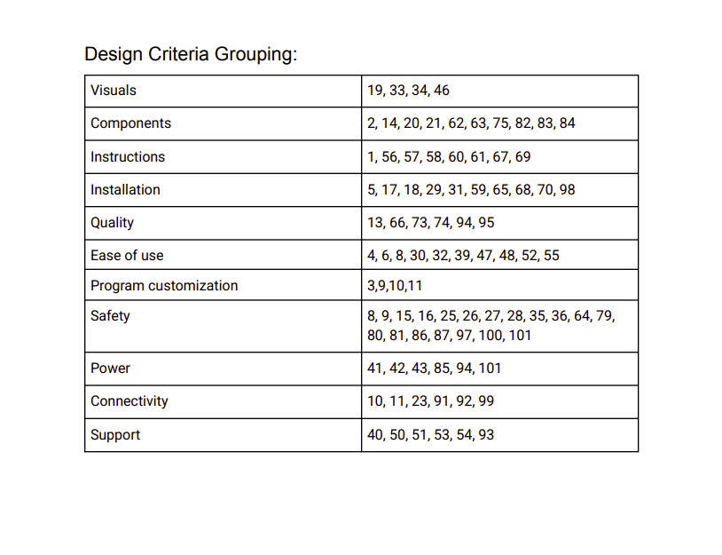
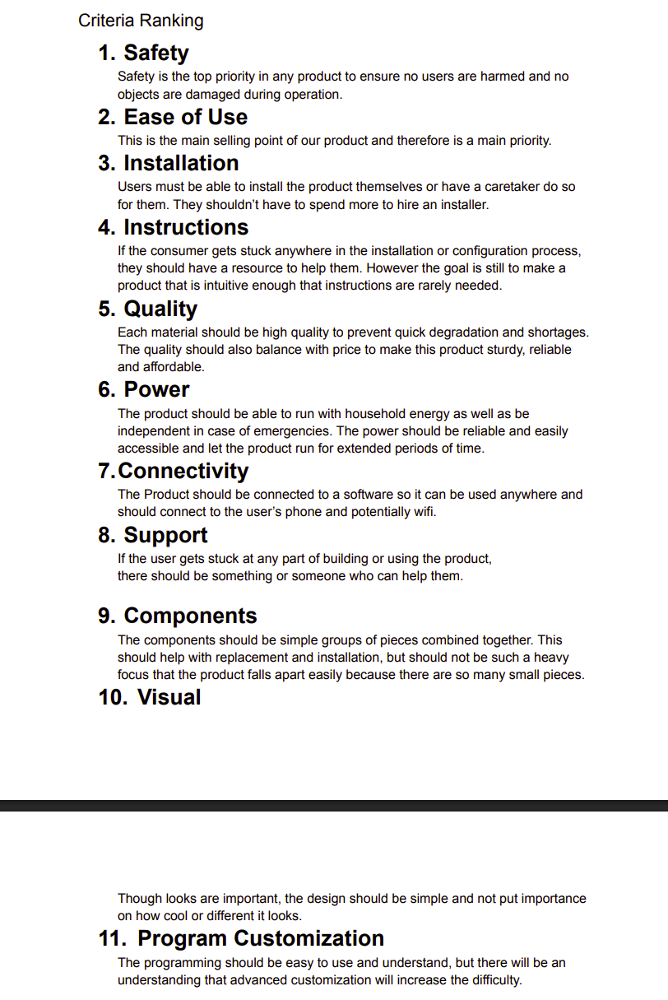

## User Needs Categorizing/Ranking Process

After we had developed the whole list of user needs based on reviews from competing products, our team seperated each individual need into categories based on the general aspect of the product that each need related to. Once this was done, the team ranked the importance of the needs by discussing which of the categories were most important in relation to our own product. The main talking points of this discussion included our product's target consumers, use-cases, and environments as well as the time/resources/materials that would be available to us as we moved forward with our design. The images below show this process.

